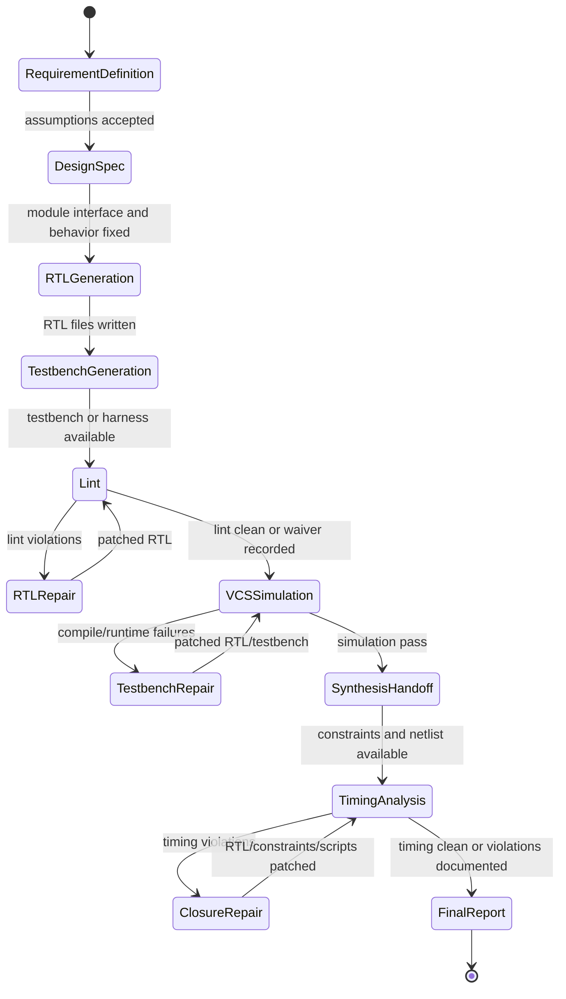

# EDA Flow Architecture Documentation Implementation Plan

> **For agentic workers:** REQUIRED SUB-SKILL: Use superpowers:subagent-driven-development (recommended) or superpowers:executing-plans to implement this plan task-by-task. Steps use checkbox (`- [ ]`) syntax for tracking.

**Goal:** Make the Cline architecture documentation and EDA workflow instructions describe a complete IC/EDA flow from user requirement definition through RTL generation, testbench, lint, VCS simulation, synthesis handoff, and timing analysis.

**Architecture:** Keep EDA-specific behavior outside the generic Cline runtime. `ARCHITECTURE.md` explains the repo-level data flow and protocol boundaries; `.agents/skills/eda-flow/SKILL.md` gives agent behavior rules; `.clinerules/workflows/eda-rtl-flow.md` exposes a user-facing slash workflow for the same flow.

**Tech Stack:** Markdown, Mermaid diagrams, Cline skill/workflow frontmatter, Hub browser WebSocket protocol from `apps/cline-hub/src/webview-protocol.ts`, shell verification with `rg`.

---

## File Structure

| File | Responsibility |
| --- | --- |
| `ARCHITECTURE.md` | Repository-level EDA flow narrative, state machine, artifact contract, protocol table, and end-to-end call chain. |
| `.agents/skills/eda-flow/SKILL.md` | Agent-facing EDA operating procedure for RTL, lint, VCS, synthesis, STA, artifact handling, and final reporting. |
| `.clinerules/workflows/eda-rtl-flow.md` | User-facing slash workflow text for `/eda-rtl-flow`, aligned with the skill and architecture document. |
| `docs/superpowers/plans/2026-07-20-eda-flow-architecture.md` | This implementation plan. |

## Current Constraint

Running `git status --short` in `/Users/james/Desktop/cline-main` currently returns:

```text
fatal: not a git repository (or any of the parent directories): .git
```

Each task still includes commit commands for a normal git checkout. In this local copy, execute the file edits and verification commands, then skip the commit command when Git reports the same error.

## Scope Check

This is one documentation and instruction-alignment project. It touches the architecture document, one skill, and one workflow. It does not change Cline runtime behavior, Hub protocol code, model-provider code, MCP implementation, or EDA tool execution code.

### Task 1: Add An Explicit EDA Flow State Machine

**Files:**
- Modify: `ARCHITECTURE.md`, section `## Example Data Flow: IC/EDA Workflow`

- [ ] **Step 1: Verify the current gap**

Run:

```bash
rg -n "EDA Flow State Machine|Acceptance Gates|Artifact Contract|Design Closure Handoff" ARCHITECTURE.md
```

Expected before this task:

```text
no matches
```

- [ ] **Step 2: Insert the EDA flow state machine**

Insert this block in `ARCHITECTURE.md` immediately after the paragraph that ends with:

```text
can flow through the system.
```

````markdown
### EDA Flow State Machine

For an overnight IC design cycle, Cline should treat the work as a gated flow,
not as a single code-generation prompt. Each stage produces durable artifacts
that the next stage consumes. The agent may loop backward when an EDA report
shows a concrete failure.



### Acceptance Gates

| Gate | Required evidence | Continue rule |
| --- | --- | --- |
| Requirement definition | Module purpose, interface, clock/reset, protocol, registers, latency/throughput, assumptions | Continue when the user or project rules accept the design contract. |
| RTL generation | SystemVerilog/Verilog files plus reset and protocol behavior | Continue when generated RTL matches the accepted spec. |
| Testbench generation | SV/UVM/Cocotb/project harness, smoke stimulus, expected results | Continue when the testbench can compile or the missing harness dependency is documented. |
| Lint | Lint log, warning/error summary, waivers when policy allows | Continue when blocking lint errors are fixed. |
| VCS simulation | Compile log, run log, pass/fail status, waves or coverage when enabled | Continue when the target smoke/regression passes. |
| Synthesis handoff | Constraints, synthesis script, netlist/report locations | Continue when synthesis inputs are present and script invocation is known. |
| Timing analysis | STA command, SDC/lib/SPEF inputs, timing report, violating paths | Finish when timing is clean or unresolved violations are summarized with next actions. |

### Artifact Contract

| Artifact | Producer | Consumer |
| --- | --- | --- |
| Requirement spec | Agent plus user approvals | RTL generator, testbench generator, final report |
| RTL source | Agent file-edit tool | Lint, simulation, synthesis |
| Testbench | Agent file-edit tool or project harness | VCS simulation and regression scripts |
| Lint report | Local shell command, MCP tool, or EDA farm adapter | Agent repair loop and final report |
| Simulation report | VCS wrapper, project script, MCP tool, or EDA farm adapter | Agent repair loop and final report |
| Synthesis reports | DC/Genus/Yosys/project flow | Timing analysis and QoR review |
| Timing reports | PrimeTime/OpenSTA/project flow | Closure repair loop and final report |
````

- [ ] **Step 3: Verify the state machine landed**

Run:

```bash
rg -n "EDA Flow State Machine|Acceptance Gates|Artifact Contract|Requirement definition|VCSSimulation|TimingAnalysis" ARCHITECTURE.md
```

Expected after this task: matches for every search term.

- [ ] **Step 4: Commit the documentation checkpoint**

Run in a real git checkout:

```bash
git add ARCHITECTURE.md
git commit -m "docs: clarify EDA flow state machine"
```

Expected in this local copy without `.git`:

```text
fatal: not a git repository (or any of the parent directories): .git
```

### Task 2: Make Protocol And Wire Boundaries Concrete

**Files:**
- Modify: `ARCHITECTURE.md`, section `### Protocol Boundaries`

- [ ] **Step 1: Verify current wire examples are missing**

Run:

```bash
rg -n "Wire Shape Examples|WebviewInboundMessage|WebviewOutboundMessage|eda__submit_vcs_job|streamable HTTP" ARCHITECTURE.md
```

Expected before this task: `eda__submit_vcs_job` may already match; the other terms should not all match in one protocol-focused subsection.

- [ ] **Step 2: Add protocol-level wire examples**

Insert this block after the protocol boundary table in `ARCHITECTURE.md`:

```markdown
#### Wire Shape Examples

The Hub browser WebSocket contract is typed in
`apps/cline-hub/src/webview-protocol.ts`. The architecture-level flow should use
the same message names when explaining live streaming and approvals.

| Direction | Transport | Example message shape | Meaning |
| --- | --- | --- | --- |
| Browser to Hub server | WebSocket `/browser` | `{ "type": "send", "prompt": "Generate an AXI-lite register block and run lint" }` | User starts or continues an EDA task from the Hub UI. |
| Hub server to Browser | WebSocket `/browser` | `{ "type": "assistant_delta", "text": "Created rtl/reg_block.sv" }` | Partial assistant output streamed into the browser. |
| Hub server to Browser | WebSocket `/browser` | `{ "type": "tool_event", "text": "Running make lint", "event": { "status": "running", "toolName": "shell" } }` | Tool execution progress rendered in the Hub UI. |
| Hub server to Browser | WebSocket `/browser` | `{ "type": "approval_request", "toolName": "shell", "input": { "command": "vcs -full64 ..." } }` | User approval gate before a sensitive command. |
| Browser to Hub server | WebSocket `/browser` | `{ "type": "approval_response", "approvalId": "approval-123", "approved": true }` | User allows the requested tool execution. |
| Core to local EDA wrapper | MCP stdio or shell stdio | `run_lint({ "target": "rtl/reg_block.sv" })` or `make lint` | Local tool invocation with stdout/stderr, exit code, and report files. |
| Core to remote EDA service | MCP over SSE or streamable HTTP | `eda__submit_vcs_job({ "test": "smoke", "rtl": ["rtl/reg_block.sv"] })` | Remote job submission through a typed MCP tool. |
| Remote EDA service to artifact store | HTTP/gRPC/job queue plus filesystem/object storage | `{ "jobId": "vcs-7421", "status": "running", "log": "logs/vcs-7421.log" }` | Project-specific farm status and report location. |

Rule of thumb: HTTP serves configuration, static assets, and request/response
APIs; WebSocket carries live browser session events; MCP provides typed tool
boundaries; shell stdio and files remain the most common data plane for local
EDA tools.
```

- [ ] **Step 3: Verify real protocol names are reflected**

Run:

```bash
rg -n "Wire Shape Examples|WebSocket `/browser`|assistant_delta|tool_event|approval_request|approval_response|streamable HTTP|eda__submit_vcs_job" ARCHITECTURE.md
```

Expected after this task: matches for every listed protocol name.

- [ ] **Step 4: Cross-check against the source protocol type**

Run:

```bash
rg -n 'type: "send"|type: "assistant_delta"|type: "tool_event"|type: "approval_request"|type: "approval_response"|type: "turn_done"' apps/cline-hub/src/webview-protocol.ts
```

Expected after this task: source matches all browser WebSocket message names used in the architecture document.

- [ ] **Step 5: Commit the protocol checkpoint**

Run in a real git checkout:

```bash
git add ARCHITECTURE.md
git commit -m "docs: document EDA protocol boundaries"
```

Expected in this local copy without `.git`:

```text
fatal: not a git repository (or any of the parent directories): .git
```

### Task 3: Expand The EDA Skill Into An Agent Operating Procedure

**Files:**
- Modify: `.agents/skills/eda-flow/SKILL.md`

- [ ] **Step 1: Verify current skill is minimal**

Run:

```bash
rg -n "When To Use|Inputs To Collect|Execution Policy|Final Response Format|Stop Conditions" .agents/skills/eda-flow/SKILL.md
```

Expected before this task:

```text
no matches
```

- [ ] **Step 2: Replace the skill file with concrete EDA instructions**

Replace `.agents/skills/eda-flow/SKILL.md` with:

```markdown
# EDA Flow

Use this skill when working on RTL generation, lint, simulation, VCS, synthesis
handoff, timing analysis, or EDA tool orchestration.

## When To Use

Use this skill for requests such as:

- define an IC block requirement
- generate Verilog or SystemVerilog RTL
- create or launch a testbench
- run lint, VCS, synthesis, or STA
- interpret EDA logs and repair RTL/testbench files
- summarize design artifacts and unresolved timing or verification issues

## Inputs To Collect

Before changing files or launching tools, collect:

- block purpose and top module name
- clock and reset names, polarity, and synchronous/asynchronous behavior
- interface protocol, valid/ready behavior, register map, or bus mapping
- latency, throughput, width, depth, and backpressure expectations
- coding rules, existing RTL style, and directory layout
- testbench framework: SV, UVM, Cocotb, project scripts, or existing harness
- available commands: lint, sim, VCS, synthesis, STA
- license or environment setup commands such as `module load`, `source`, or project wrappers

## Workflow

1. Clarify design requirements and write down assumptions.
2. Inspect existing RTL, verification, scripts, constraints, and reports.
3. Produce or update a requirement/spec document when the task is more than a trivial edit.
4. Generate or patch RTL in the repository's existing style.
5. Generate or patch the testbench, smoke test, or project harness.
6. Run lint through the configured project command, shell wrapper, or MCP tool.
7. Read lint diagnostics and patch only the files required to address concrete findings.
8. Launch simulation through VCS or the project regression wrapper when available.
9. Read compile/run logs, waves, and coverage summaries when generated.
10. Hand off to synthesis and STA only when required inputs are present.
11. Summarize files changed, commands run, reports read, failures fixed, and remaining risks.

## Execution Policy

- Prefer project commands such as `make lint`, `make sim`, `make vcs`, and `make sta` when they exist.
- Prefer MCP tools when the project exposes typed EDA actions such as `run_lint`, `submit_vcs_job`, or `parse_timing_report`.
- Use direct shell commands only when project wrappers are absent and the exact command is known.
- Ask for user approval before long-running jobs, license-heavy jobs, destructive cleanup, or farm submission.
- Treat stdout/stderr plus generated report files as the source of truth.
- Do not invent a passing result; report unavailable tools or missing licenses explicitly.

## Stop Conditions

Stop and report when:

- the requested design contract is ambiguous and no safe assumption can be made
- required EDA tools or licenses are unavailable
- lint or simulation failures remain after the requested repair budget
- synthesis or STA inputs are missing
- a timing violation needs architectural tradeoffs the user must decide

## Final Response Format

End with:

- requirement/spec summary
- RTL files changed
- testbench or verification files changed
- commands run and pass/fail status
- generated reports or artifact paths
- unresolved issues and next concrete commands
```

- [ ] **Step 3: Verify the expanded skill sections exist**

Run:

```bash
rg -n "When To Use|Inputs To Collect|Execution Policy|Final Response Format|Stop Conditions|submit_vcs_job|parse_timing_report" .agents/skills/eda-flow/SKILL.md
```

Expected after this task: matches for every section name and tool example.

- [ ] **Step 4: Commit the skill checkpoint**

Run in a real git checkout:

```bash
git add .agents/skills/eda-flow/SKILL.md
git commit -m "docs: expand EDA flow skill"
```

Expected in this local copy without `.git`:

```text
fatal: not a git repository (or any of the parent directories): .git
```

### Task 4: Align The Slash Workflow With The Skill And Architecture Document

**Files:**
- Modify: `.clinerules/workflows/eda-rtl-flow.md`

- [ ] **Step 1: Verify the workflow is still a short checklist**

Run:

```bash
wc -l .clinerules/workflows/eda-rtl-flow.md
rg -n "Output Contract|Protocol Choice|Approval Gates|Use this flow when" .clinerules/workflows/eda-rtl-flow.md
```

Expected before this task:

```text
10 .clinerules/workflows/eda-rtl-flow.md
no matches for the rg command
```

- [ ] **Step 2: Replace the workflow with user-facing slash command guidance**

Replace `.clinerules/workflows/eda-rtl-flow.md` with:

```markdown
---
name: eda-rtl-flow
description: RTL generation and EDA verification workflow
---

Use this flow when the user asks for an IC/EDA task such as requirement
definition, RTL generation, testbench creation, lint, VCS simulation, synthesis
handoff, or timing analysis.

## Operating Mode

Treat the request as a gated EDA flow:

1. Requirement definition
2. Design/spec capture
3. RTL generation or repair
4. Testbench generation or repair
5. Lint
6. VCS compile and simulation
7. Synthesis handoff
8. Timing analysis
9. Final report

## Protocol Choice

- Use file edits for RTL, specs, testbenches, constraints, and report summaries.
- Use shell commands for local project wrappers such as `make lint`, `make sim`, `make vcs`, and `make sta`.
- Use MCP tools for typed local or remote EDA integrations.
- Use HTTP, SSE, WebSocket, or job queue only through project-provided wrappers or MCP tools.
- Use the Hub `/browser` WebSocket only for UI-facing session messages such as streamed assistant output, tool progress, approvals, and turn completion.

## Approval Gates

Ask before:

- launching long-running VCS, synthesis, or STA jobs
- consuming scarce licenses
- submitting remote farm jobs
- deleting generated artifacts or cleaning work directories
- changing constraints that affect timing closure tradeoffs

## Output Contract

End the response with:

- accepted requirements and assumptions
- files created or changed
- commands run
- lint, simulation, synthesis, and timing status
- report paths
- unresolved risks
- next command the user can run
```

- [ ] **Step 3: Verify workflow command metadata and sections**

Run:

```bash
rg -n "name: eda-rtl-flow|Output Contract|Protocol Choice|Approval Gates|Hub `/browser` WebSocket|make vcs|make sta" .clinerules/workflows/eda-rtl-flow.md
```

Expected after this task: matches for command name, protocol guidance, approval gates, and output contract.

- [ ] **Step 4: Commit the workflow checkpoint**

Run in a real git checkout:

```bash
git add .clinerules/workflows/eda-rtl-flow.md
git commit -m "docs: align EDA workflow instructions"
```

Expected in this local copy without `.git`:

```text
fatal: not a git repository (or any of the parent directories): .git
```

### Task 5: Run Final Documentation Verification

**Files:**
- Check: `ARCHITECTURE.md`
- Check: `.agents/skills/eda-flow/SKILL.md`
- Check: `.clinerules/workflows/eda-rtl-flow.md`
- Check: `docs/assets/architecture/cline-hub-sessions-view.png`

- [ ] **Step 1: Verify all EDA architecture anchors**

Run:

```bash
rg -n "EDA Flow State Machine|Acceptance Gates|Artifact Contract|Wire Shape Examples|Runtime Streaming Path|Frontend / Backend Packaging For EDA Deployments|Protocol-Level EDA Example|End-To-End Call Chain" ARCHITECTURE.md
```

Expected after implementation: every listed heading or phrase appears in `ARCHITECTURE.md`.

- [ ] **Step 2: Verify workflow and skill alignment**

Run:

```bash
rg -n "Requirement definition|RTL generation|testbench|lint|VCS|synthesis|timing analysis|Final Response Format|Output Contract" .agents/skills/eda-flow/SKILL.md .clinerules/workflows/eda-rtl-flow.md
```

Expected after implementation: both files mention the same major EDA stages and final reporting expectations.

- [ ] **Step 3: Verify Hub screenshot asset still exists**

Run:

```bash
test -f docs/assets/architecture/cline-hub-sessions-view.png && echo "hub screenshot asset present"
```

Expected after implementation:

```text
hub screenshot asset present
```

- [ ] **Step 4: Verify no stale port guidance was introduced**

Run:

```bash
rg -n "7897|8787" ARCHITECTURE.md .agents/skills/eda-flow/SKILL.md .clinerules/workflows/eda-rtl-flow.md
```

Expected after implementation: no `7897` matches. `8787` may appear only when describing existing Hub examples or screenshots, not as a required deployment port.

- [ ] **Step 5: Commit the final checkpoint**

Run in a real git checkout:

```bash
git add ARCHITECTURE.md .agents/skills/eda-flow/SKILL.md .clinerules/workflows/eda-rtl-flow.md docs/superpowers/plans/2026-07-20-eda-flow-architecture.md
git commit -m "docs: plan EDA architecture flow"
```

Expected in this local copy without `.git`:

```text
fatal: not a git repository (or any of the parent directories): .git
```

## Self-Review

Spec coverage:

- Complete call chain from user requirement to RTL, testbench, lint, VCS, synthesis, STA, and final report is covered in Tasks 1 and 5.
- HTTP, WebSocket, MCP, shell stdio, job queue, and filesystem boundaries are covered in Task 2.
- Agent operating behavior is covered in Task 3.
- User slash workflow behavior is covered in Task 4.
- Hub browser view and no-required-7897-port check are covered in Task 5.

Placeholder scan:

- The plan uses concrete filenames, concrete markdown content, concrete commands, and concrete expected outcomes.

Type and naming consistency:

- Workflow name is consistently `eda-rtl-flow`.
- Skill file path is consistently `.agents/skills/eda-flow/SKILL.md`.
- Hub browser WebSocket message names match `apps/cline-hub/src/webview-protocol.ts`: `send`, `assistant_delta`, `tool_event`, `approval_request`, `approval_response`, and `turn_done`.
