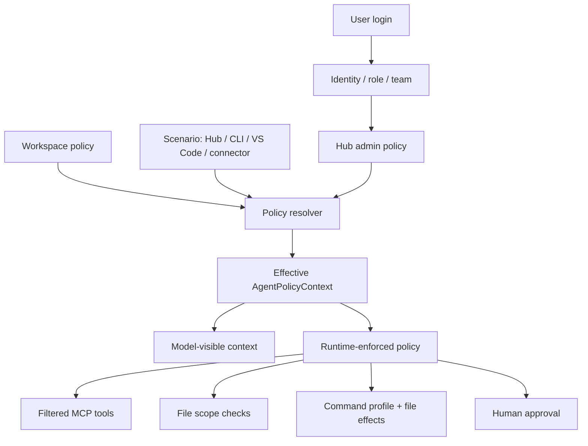

# Policy-Bound Agent Context Implementation Plan

> **For agentic workers:** REQUIRED SUB-SKILL: Use superpowers:subagent-driven-development (recommended) or superpowers:executing-plans to implement this plan task-by-task. Steps use checkbox (`- [ ]`) syntax for tracking.

**Goal:** Add a policy-bound Agent Context so Cline Hub can build per-user, per-scenario MCP tool, file access, Linux command, and human-approval policy after login, then enforce that policy in the core runtime and tool executors.

**Architecture:** Hub is the long-term admin/configuration surface, but enforcement must live in `@cline/core` and shared contracts. The model sees a concise policy context through runtime metadata/system context, while MCP exposure, file tools, shell commands, and approval decisions are enforced by runtime filters and executor wrappers.

**Tech Stack:** TypeScript, Bun workspace, Vitest, React Hub webview, `@cline/shared` tool policy contracts, `@cline/core` runtime builder/tool executors, Hub WebSocket approval protocol.

---

## Source Spec

This plan implements the repo change scope described in:

- `docs/superpowers/specs/2026-07-20-policy-bound-agent-context.html`

The current workspace at `/Users/james/Desktop/cline-main` is not a git checkout:

```text
fatal: not a git repository (or any of the parent directories): .git
```

Commit steps below are still included for a normal checkout. In this local copy, run the edit and test commands, then skip commit commands if Git reports the same error.

## Change Scope Summary

| Area | Scope | Main files |
| --- | --- | --- |
| Shared contracts | Extend tool policy payloads and define reusable policy context/effect types. | `sdk/packages/shared/src/llms/tools.ts`, `sdk/packages/shared/src/agent.ts`, `sdk/packages/shared/src/index.ts` |
| Core config | Allow sessions to carry `policyContext` and pass it into runtime/tool metadata. | `sdk/packages/core/src/types/config.ts`, `sdk/packages/core/src/runtime/host/runtime-host.ts`, `sdk/packages/core/src/runtime/orchestration/session-runtime.ts` |
| Core policy engine | Add file-scope, command-profile, MCP allowlist, and combined effect evaluation. | New `sdk/packages/core/src/runtime/policy/*` |
| Tool enforcement | Wrap built-in file/shell/edit tools and filter MCP tools by policy. | `sdk/packages/core/src/extensions/tools/*`, `sdk/packages/core/src/extensions/mcp/tools.ts`, `sdk/packages/core/src/runtime/orchestration/runtime-builder.ts` |
| Hub session start | Resolve effective policy from user/scenario/workspace/admin config before `ctx.cline.start`. | `apps/cline-hub/src/server/sessions.ts`, new `apps/cline-hub/src/server/policy-context.ts` |
| Hub UI | Add Policy Context preview/admin view and richer approval display. | `apps/cline-hub/src/webview/src/components/views/settings/*`, `apps/cline-hub/src/webview/src/Chat.tsx`, `apps/cline-hub/src/webview-protocol.ts` |
| CLI/connectors | Show policy reason/effects in terminal approval prompts and connector flows. | `apps/cli/src/tui/components/dialogs/tool-approval.tsx`, `apps/cli/src/utils/approval.ts`, `apps/cli/src/connectors/*` |
| Docs/tests | Add architecture docs and unit/integration coverage. | `ARCHITECTURE.md`, package-local tests |

## Out Of Scope For MVP

- Full enterprise RBAC, SSO group sync, and admin database migrations.
- A production policy editor with multi-admin review and policy version publishing.
- Deep static analysis of arbitrary shell strings such as `bash -c`, heredocs, `find -exec`, or arbitrary Python scripts.
- Allowing human approval to override denied policy.
- Hardcoding EDA tool semantics directly into the generic agent loop.

## Design Decisions

1. Hub owns long-term central configuration, but Core owns enforcement.
2. Workspace policy can narrow or describe project-specific paths/commands, but cannot weaken Hub deny rules.
3. Human approval applies only to `approval_required` decisions, never to `deny`.
4. MCP tools that are denied should not be exposed to the model.
5. File and command policy must be evaluated together before command execution.
6. Shell string commands are supported only through command profiles; structured commands are preferred for reliable matching.

## File Structure

Create these new Core policy files:

```text
sdk/packages/core/src/runtime/policy/index.ts
sdk/packages/core/src/runtime/policy/types.ts
sdk/packages/core/src/runtime/policy/path-policy.ts
sdk/packages/core/src/runtime/policy/command-policy.ts
sdk/packages/core/src/runtime/policy/tool-policy.ts
sdk/packages/core/src/runtime/policy/executor-wrappers.ts
sdk/packages/core/src/runtime/policy/policy-context.test.ts
```

Create these Hub policy files:

```text
apps/cline-hub/src/server/policy-context.ts
apps/cline-hub/src/server/policy-context.test.ts
apps/cline-hub/src/webview/src/components/views/settings/policy-context-view.tsx
```

Modify existing files listed in each task.

### Task 1: Shared Policy Contract

**Files:**
- Modify: `sdk/packages/shared/src/llms/tools.ts`
- Modify: `sdk/packages/shared/src/agent.ts`
- Modify: `sdk/packages/shared/src/index.ts`
- Test: `sdk/packages/shared/src/llms/tools-policy-context.test.ts`

- [ ] **Step 1: Write shared policy type tests**

Create `sdk/packages/shared/src/llms/tools-policy-context.test.ts`:

```ts
import { describe, expect, it } from "vitest";
import type {
	AgentPolicyContext,
	PolicyEffect,
	ToolPolicy,
} from "./tools";

describe("policy-bound agent context types", () => {
	it("allows policy context with MCP, file, command, and approval fields", () => {
		const effect: PolicyEffect = {
			kind: "write",
			path: "/proj/chip/top/logs/**",
			source: "command_profile",
		};
		const context: AgentPolicyContext = {
			id: "policy-eda-linux",
			scenario: "eda-linux-hub-session",
			mcpTools: ["eda.run_lint", "eda.submit_vcs_job"],
			fileScopes: [
				{
					name: "rtl",
					path: "/proj/chip/top/rtl",
					access: ["read", "write"],
				},
			],
			commandProfiles: [
				{
					id: "make-vcs",
					command: "make vcs TEST=*",
					cwd: "/proj/chip/top",
					effects: [effect],
					decision: "approval_required",
					approvalReason:
						"VCS consumes shared simulation licenses and may run for a long time.",
				},
			],
			deny: ["**/.env", "**/secrets/**"],
		};
		const policy: ToolPolicy = {
			enabled: true,
			autoApprove: false,
			decision: "approval_required",
			approvalReason: "Command requires confirmation.",
			effects: [effect],
			policyContextId: context.id,
		};

		expect(policy.effects?.[0]?.path).toBe("/proj/chip/top/logs/**");
		expect(context.commandProfiles[0]?.decision).toBe("approval_required");
	});
});
```

- [ ] **Step 2: Run the failing shared test**

Run:

```bash
bun -F @cline/shared test:unit -- src/llms/tools-policy-context.test.ts
```

Expected before implementation:

```text
error TS2305: Module '"./tools"' has no exported member 'AgentPolicyContext'
```

- [ ] **Step 3: Extend shared tool policy types**

Modify `sdk/packages/shared/src/llms/tools.ts` by adding these exports above `ToolPolicy` and extending `ToolPolicy`:

```ts
export type PolicyDecision = "allow" | "approval_required" | "deny";

export type PolicyEffectKind =
	| "read"
	| "write"
	| "delete"
	| "execute"
	| "network"
	| "license";

export interface PolicyEffect {
	kind: PolicyEffectKind;
	path?: string;
	command?: string;
	toolName?: string;
	source?: "file_scope" | "command_profile" | "mcp_tool" | "runtime";
	reason?: string;
}

export interface FileScopePolicy {
	name: string;
	path: string;
	access: Array<"read" | "write" | "delete">;
}

export interface CommandProfilePolicy {
	id: string;
	command: string;
	cwd?: string;
	effects: PolicyEffect[];
	decision: PolicyDecision;
	approvalReason?: string;
}

export interface AgentPolicyContext {
	id: string;
	scenario: string;
	userId?: string;
	roles?: string[];
	teams?: string[];
	mcpTools?: string[];
	fileScopes?: FileScopePolicy[];
	commandProfiles?: CommandProfilePolicy[];
	deny?: string[];
	auditTags?: string[];
}
```

Extend `ToolPolicy`:

```ts
export interface ToolPolicy {
	/**
	 * Whether the tool can be executed at all.
	 * @default true
	 */
	enabled?: boolean;
	/**
	 * Whether this tool can run without asking the client for approval.
	 * @default true
	 */
	autoApprove?: boolean;
	/**
	 * Effective policy decision for this exact tool/action.
	 */
	decision?: PolicyDecision;
	/**
	 * Human-readable reason shown in approval or deny UI.
	 */
	approvalReason?: string;
	/**
	 * Declared or inferred effects for this tool call.
	 */
	effects?: PolicyEffect[];
	/**
	 * Effective context id used for audit correlation.
	 */
	policyContextId?: string;
}
```

- [ ] **Step 4: Add policy context to agent config metadata**

Modify `sdk/packages/shared/src/agent.ts` in `AgentConfig` to allow:

```ts
policyContext?: import("./llms/tools").AgentPolicyContext;
```

Keep `toolContextMetadata?: Record<string, unknown>;` unchanged.

- [ ] **Step 5: Export types**

If `sdk/packages/shared/src/index.ts` does not already export `./llms/tools`, add or extend exports so downstream packages can import:

```ts
export type {
	AgentPolicyContext,
	CommandProfilePolicy,
	FileScopePolicy,
	PolicyDecision,
	PolicyEffect,
	ToolPolicy,
} from "./llms/tools";
```

- [ ] **Step 6: Verify shared package**

Run:

```bash
bun -F @cline/shared test:unit -- src/llms/tools-policy-context.test.ts
bun -F @cline/shared typecheck
```

Expected after implementation:

```text
Test Files  1 passed
```

- [ ] **Step 7: Commit shared contract**

Run in a real git checkout:

```bash
git add sdk/packages/shared/src/llms/tools.ts sdk/packages/shared/src/agent.ts sdk/packages/shared/src/index.ts sdk/packages/shared/src/llms/tools-policy-context.test.ts
git commit -m "feat: add policy-bound agent context types"
```

### Task 2: Core Policy Engine

**Files:**
- Create: `sdk/packages/core/src/runtime/policy/types.ts`
- Create: `sdk/packages/core/src/runtime/policy/path-policy.ts`
- Create: `sdk/packages/core/src/runtime/policy/command-policy.ts`
- Create: `sdk/packages/core/src/runtime/policy/tool-policy.ts`
- Create: `sdk/packages/core/src/runtime/policy/index.ts`
- Test: `sdk/packages/core/src/runtime/policy/policy-context.test.ts`

- [ ] **Step 1: Write policy engine tests**

Create `sdk/packages/core/src/runtime/policy/policy-context.test.ts`:

```ts
import { describe, expect, it } from "vitest";
import {
	evaluateCommandPolicy,
	evaluateFilePolicy,
	filterMcpToolsByPolicy,
} from "./index";
import type { AgentPolicyContext } from "@cline/shared";

const context: AgentPolicyContext = {
	id: "policy-eda-linux",
	scenario: "eda-linux-hub-session",
	mcpTools: ["eda.run_lint", "eda.submit_vcs_job"],
	fileScopes: [
		{ name: "rtl", path: "/proj/chip/top/rtl", access: ["read", "write"] },
		{ name: "sim", path: "/proj/chip/top/sim", access: ["read", "write"] },
	],
	commandProfiles: [
		{
			id: "make-vcs",
			command: "make vcs TEST=*",
			cwd: "/proj/chip/top",
			decision: "approval_required",
			approvalReason: "VCS uses shared licenses.",
			effects: [
				{ kind: "read", path: "/proj/chip/top/rtl/**" },
				{ kind: "write", path: "/proj/chip/top/sim/**" },
			],
		},
	],
	deny: ["**/.env", "**/secrets/**", "/license/**"],
};

describe("policy context evaluation", () => {
	it("allows file reads inside an allowed file scope", () => {
		const decision = evaluateFilePolicy(context, {
			kind: "read",
			path: "/proj/chip/top/rtl/reg_block.sv",
		});
		expect(decision.decision).toBe("allow");
	});

	it("denies file access matching a deny pattern", () => {
		const decision = evaluateFilePolicy(context, {
			kind: "read",
			path: "/proj/chip/top/secrets/token.txt",
		});
		expect(decision.decision).toBe("deny");
	});

	it("marks VCS command as approval required when effects are in scope", () => {
		const decision = evaluateCommandPolicy(context, {
			command: "make vcs TEST=smoke",
			cwd: "/proj/chip/top",
		});
		expect(decision.decision).toBe("approval_required");
		expect(decision.policy.approvalReason).toContain("VCS");
	});

	it("denies unprofiled destructive commands", () => {
		const decision = evaluateCommandPolicy(context, {
			command: "rm -rf /proj/chip/top/sim",
			cwd: "/proj/chip/top",
		});
		expect(decision.decision).toBe("deny");
	});

	it("filters MCP tools by allowlist", () => {
		expect(
			filterMcpToolsByPolicy(
				[
					{ name: "eda.run_lint" },
					{ name: "filesystem.delete_tree" },
				],
				context,
			).map((tool) => tool.name),
		).toEqual(["eda.run_lint"]);
	});
});
```

- [ ] **Step 2: Run the failing core policy test**

Run:

```bash
bun -F @cline/core test:unit -- src/runtime/policy/policy-context.test.ts
```

Expected before implementation:

```text
Cannot find module './index'
```

- [ ] **Step 3: Add policy result types**

Create `sdk/packages/core/src/runtime/policy/types.ts`:

```ts
import type { PolicyDecision, ToolPolicy } from "@cline/shared";

export interface FilePolicyCheckInput {
	kind: "read" | "write" | "delete";
	path: string;
}

export interface CommandPolicyCheckInput {
	command: string;
	cwd: string;
}

export interface PolicyCheckResult {
	decision: PolicyDecision;
	reason?: string;
	policy: ToolPolicy;
}
```

- [ ] **Step 4: Implement path policy**

Create `sdk/packages/core/src/runtime/policy/path-policy.ts`:

```ts
import path from "node:path";
import type { AgentPolicyContext } from "@cline/shared";
import type { FilePolicyCheckInput, PolicyCheckResult } from "./types";

function normalizePath(input: string): string {
	return path.normalize(input);
}

function matchesPrefixOrGlob(candidate: string, pattern: string): boolean {
	const normalizedPattern = normalizePath(pattern.replace(/\*\*$/, ""));
	if (pattern.endsWith("/**")) {
		return candidate === normalizedPattern.slice(0, -1) || candidate.startsWith(normalizedPattern);
	}
	if (pattern.startsWith("**/")) {
		return candidate.includes(pattern.slice(3).replace("/**", ""));
	}
	return candidate === normalizePath(pattern) || candidate.startsWith(`${normalizePath(pattern)}/`);
}

export function evaluateFilePolicy(
	context: AgentPolicyContext | undefined,
	input: FilePolicyCheckInput,
): PolicyCheckResult {
	if (!context) {
		return { decision: "allow", policy: { enabled: true, autoApprove: true } };
	}
	const filePath = normalizePath(input.path);
	for (const deny of context.deny ?? []) {
		if (matchesPrefixOrGlob(filePath, deny)) {
			return {
				decision: "deny",
				reason: `Path is denied by policy: ${deny}`,
				policy: {
					enabled: false,
					autoApprove: false,
					decision: "deny",
					approvalReason: `Path is denied by policy: ${deny}`,
					policyContextId: context.id,
					effects: [{ kind: input.kind, path: filePath, source: "file_scope" }],
				},
			};
		}
	}
	for (const scope of context.fileScopes ?? []) {
		if (scope.access.includes(input.kind) && matchesPrefixOrGlob(filePath, `${scope.path}/**`)) {
			return {
				decision: "allow",
				policy: {
					enabled: true,
					autoApprove: true,
					decision: "allow",
					policyContextId: context.id,
					effects: [{ kind: input.kind, path: filePath, source: "file_scope" }],
				},
			};
		}
	}
	return {
		decision: "deny",
		reason: `No ${input.kind} file scope covers ${filePath}`,
		policy: {
			enabled: false,
			autoApprove: false,
			decision: "deny",
			approvalReason: `No ${input.kind} file scope covers ${filePath}`,
			policyContextId: context.id,
			effects: [{ kind: input.kind, path: filePath, source: "file_scope" }],
		},
	};
}
```

- [ ] **Step 5: Implement command policy**

Create `sdk/packages/core/src/runtime/policy/command-policy.ts`:

```ts
import type { AgentPolicyContext, PolicyEffect } from "@cline/shared";
import { evaluateFilePolicy } from "./path-policy";
import type { CommandPolicyCheckInput, PolicyCheckResult } from "./types";

function commandMatches(command: string, pattern: string): boolean {
	if (pattern.endsWith("*")) {
		return command.startsWith(pattern.slice(0, -1));
	}
	return command === pattern;
}

function fileEffectDecision(
	context: AgentPolicyContext,
	effects: PolicyEffect[],
): PolicyCheckResult | undefined {
	for (const effect of effects) {
		if (!effect.path) continue;
		if (effect.kind !== "read" && effect.kind !== "write" && effect.kind !== "delete") continue;
		const result = evaluateFilePolicy(context, {
			kind: effect.kind,
			path: effect.path.replace(/\*\*$/, "__policy_probe__"),
		});
		if (result.decision === "deny") {
			return result;
		}
	}
	return undefined;
}

export function evaluateCommandPolicy(
	context: AgentPolicyContext | undefined,
	input: CommandPolicyCheckInput,
): PolicyCheckResult {
	if (!context) {
		return { decision: "allow", policy: { enabled: true, autoApprove: true } };
	}
	const profile = (context.commandProfiles ?? []).find((candidate) =>
		commandMatches(input.command, candidate.command),
	);
	if (!profile) {
		return {
			decision: "deny",
			reason: `Command is not allowlisted: ${input.command}`,
			policy: {
				enabled: false,
				autoApprove: false,
				decision: "deny",
				approvalReason: `Command is not allowlisted: ${input.command}`,
				policyContextId: context.id,
				effects: [{ kind: "execute", command: input.command, source: "command_profile" }],
			},
		};
	}
	if (profile.cwd && profile.cwd !== input.cwd) {
		return {
			decision: "deny",
			reason: `Command cwd is not allowed: ${input.cwd}`,
			policy: {
				enabled: false,
				autoApprove: false,
				decision: "deny",
				approvalReason: `Command cwd is not allowed: ${input.cwd}`,
				policyContextId: context.id,
				effects: [{ kind: "execute", command: input.command, source: "command_profile" }],
			},
		};
	}
	const fileDecision = fileEffectDecision(context, profile.effects);
	if (fileDecision) {
		return fileDecision;
	}
	return {
		decision: profile.decision,
		reason: profile.approvalReason,
		policy: {
			enabled: profile.decision !== "deny",
			autoApprove: profile.decision === "allow",
			decision: profile.decision,
			approvalReason: profile.approvalReason,
			policyContextId: context.id,
			effects: [
				{ kind: "execute", command: input.command, source: "command_profile" },
				...profile.effects,
			],
		},
	};
}
```

- [ ] **Step 6: Implement MCP filtering**

Create `sdk/packages/core/src/runtime/policy/tool-policy.ts`:

```ts
import type { AgentPolicyContext, AgentTool } from "@cline/shared";

export function filterMcpToolsByPolicy<T extends Pick<AgentTool, "name">>(
	tools: T[],
	context: AgentPolicyContext | undefined,
): T[] {
	if (!context?.mcpTools || context.mcpTools.length === 0) {
		return tools;
	}
	const allowed = new Set(context.mcpTools);
	return tools.filter((tool) => allowed.has(tool.name));
}
```

- [ ] **Step 7: Export policy engine**

Create `sdk/packages/core/src/runtime/policy/index.ts`:

```ts
export { evaluateCommandPolicy } from "./command-policy";
export { evaluateFilePolicy } from "./path-policy";
export { filterMcpToolsByPolicy } from "./tool-policy";
export type {
	CommandPolicyCheckInput,
	FilePolicyCheckInput,
	PolicyCheckResult,
} from "./types";
```

- [ ] **Step 8: Verify policy engine**

Run:

```bash
bun -F @cline/core test:unit -- src/runtime/policy/policy-context.test.ts
bun -F @cline/core typecheck
```

Expected after implementation:

```text
Test Files  1 passed
```

- [ ] **Step 9: Commit policy engine**

Run in a real git checkout:

```bash
git add sdk/packages/core/src/runtime/policy
git commit -m "feat: add policy context evaluator"
```

### Task 3: Runtime Config And Tool Metadata Integration

**Files:**
- Modify: `sdk/packages/core/src/types/config.ts`
- Modify: `sdk/packages/core/src/runtime/host/runtime-host.ts`
- Modify: `sdk/packages/core/src/runtime/orchestration/session-runtime.ts`
- Modify: `sdk/packages/core/src/runtime/orchestration/session-runtime-orchestrator.ts`
- Test: `sdk/packages/core/src/runtime/orchestration/session-runtime-orchestrator.test.ts`

- [ ] **Step 1: Write session policy context propagation test**

Add a test near the existing `toolContextMetadata` tests in `sdk/packages/core/src/runtime/orchestration/session-runtime-orchestrator.test.ts`:

```ts
it("passes policy context into tool context metadata", async () => {
	const policyContext = {
		id: "policy-eda-linux",
		scenario: "eda-linux-hub-session",
		mcpTools: ["eda.run_lint"],
	};

	let capturedMetadata: Record<string, unknown> | undefined;
	const runtime = createTestSessionRuntime({
		config: {
			...baseConfig,
			policyContext,
			tools: [
				createTool({
					name: "capture_metadata",
					description: "capture metadata",
					inputSchema: {},
					execute: async (_input, context) => {
						capturedMetadata = context.metadata;
						return "ok";
					},
				}),
			],
		},
	});

	await runtime.start(baseConfig);
	await runtime.send(baseConfig.sessionId ?? "session-test", "capture metadata");

	expect(capturedMetadata?.policyContext).toEqual(policyContext);
});
```

If the local test helper names differ, keep the assertion target unchanged: `context.metadata.policyContext` must equal the session policy context.

- [ ] **Step 2: Run failing runtime propagation test**

Run:

```bash
bun -F @cline/core test:unit -- src/runtime/orchestration/session-runtime-orchestrator.test.ts
```

Expected before implementation: the new assertion fails because `policyContext` is not propagated.

- [ ] **Step 3: Extend CoreSessionConfig**

Modify `sdk/packages/core/src/types/config.ts` in `CoreSessionConfig`:

```ts
policyContext?: import("@cline/shared").AgentPolicyContext;
```

- [ ] **Step 4: Keep policyContext transport-safe**

Modify `sdk/packages/core/src/runtime/host/runtime-host.ts` so `RuntimeSessionConfig` keeps `policyContext` in the transport-neutral config. Do not add it to `LocalOnlyCoreSessionConfigKeys`.

- [ ] **Step 5: Add policy context to runtime builder input**

Modify `sdk/packages/core/src/runtime/orchestration/session-runtime.ts`:

```ts
policyContext?: CoreSessionConfig["policyContext"];
```

Add it to `RuntimeBuilderInput` if the builder needs direct access outside `config`.

- [ ] **Step 6: Inject policy into tool metadata**

Modify `sdk/packages/core/src/runtime/orchestration/session-runtime-orchestrator.ts` in the `toolContextMetadata` block:

```ts
toolContextMetadata: {
	modelSupportsImages:
		modelInfo?.capabilities?.includes("images") ?? true,
	...(this.config.policyContext
		? { policyContext: this.config.policyContext }
		: {}),
	...this.config.toolContextMetadata,
	[CLINE_INTERNAL_TELEMETRY_METADATA_KEY]: this.telemetry,
},
```

- [ ] **Step 7: Verify runtime integration**

Run:

```bash
bun -F @cline/core test:unit -- src/runtime/orchestration/session-runtime-orchestrator.test.ts
bun -F @cline/core typecheck
```

Expected after implementation: session runtime tests pass.

- [ ] **Step 8: Commit runtime config**

Run in a real git checkout:

```bash
git add sdk/packages/core/src/types/config.ts sdk/packages/core/src/runtime/host/runtime-host.ts sdk/packages/core/src/runtime/orchestration/session-runtime.ts sdk/packages/core/src/runtime/orchestration/session-runtime-orchestrator.ts sdk/packages/core/src/runtime/orchestration/session-runtime-orchestrator.test.ts
git commit -m "feat: propagate policy context through runtime"
```

### Task 4: Built-In Tool Enforcement

**Files:**
- Create: `sdk/packages/core/src/runtime/policy/executor-wrappers.ts`
- Modify: `sdk/packages/core/src/runtime/orchestration/runtime-builder.ts`
- Test: `sdk/packages/core/src/runtime/policy/executor-wrappers.test.ts`

- [ ] **Step 1: Write executor wrapper tests**

Create `sdk/packages/core/src/runtime/policy/executor-wrappers.test.ts`:

```ts
import { describe, expect, it, vi } from "vitest";
import {
	createPolicyWrappedExecutors,
} from "./executor-wrappers";
import type { AgentPolicyContext } from "@cline/shared";

const context: AgentPolicyContext = {
	id: "policy-eda-linux",
	scenario: "eda-linux-hub-session",
	fileScopes: [
		{ name: "rtl", path: "/proj/chip/top/rtl", access: ["read", "write"] },
		{ name: "sim", path: "/proj/chip/top/sim", access: ["read", "write"] },
	],
	commandProfiles: [
		{
			id: "make-vcs",
			command: "make vcs TEST=*",
			cwd: "/proj/chip/top",
			decision: "approval_required",
			approvalReason: "VCS uses shared licenses.",
			effects: [{ kind: "write", path: "/proj/chip/top/sim/**" }],
		},
	],
	deny: ["**/secrets/**"],
};

describe("policy wrapped executors", () => {
	it("blocks file reads outside file scope", async () => {
		const readFile = vi.fn(async () => "secret");
		const wrapped = createPolicyWrappedExecutors({ readFile }, context);

		await expect(
			wrapped.readFile?.(
				{ path: "/proj/chip/top/secrets/token.txt" },
				{ agentId: "agent", iteration: 1 },
			),
		).rejects.toThrow("denied");
		expect(readFile).not.toHaveBeenCalled();
	});

	it("allows profiled commands and delegates to shell executor", async () => {
		const bash = vi.fn(async () => "ok");
		const wrapped = createPolicyWrappedExecutors({ bash }, context);

		await expect(
			wrapped.bash?.("make vcs TEST=smoke", "/proj/chip/top", {
				agentId: "agent",
				iteration: 1,
			}),
		).resolves.toBe("ok");
		expect(bash).toHaveBeenCalled();
	});

	it("blocks unprofiled commands", async () => {
		const bash = vi.fn(async () => "deleted");
		const wrapped = createPolicyWrappedExecutors({ bash }, context);

		await expect(
			wrapped.bash?.("rm -rf /proj/chip/top/sim", "/proj/chip/top", {
				agentId: "agent",
				iteration: 1,
			}),
		).rejects.toThrow("not allowlisted");
		expect(bash).not.toHaveBeenCalled();
	});
});
```

- [ ] **Step 2: Run failing executor tests**

Run:

```bash
bun -F @cline/core test:unit -- src/runtime/policy/executor-wrappers.test.ts
```

Expected before implementation:

```text
Cannot find module './executor-wrappers'
```

- [ ] **Step 3: Implement executor wrappers**

Create `sdk/packages/core/src/runtime/policy/executor-wrappers.ts`:

```ts
import type { AgentPolicyContext } from "@cline/shared";
import type { ToolExecutors } from "../../extensions/tools";
import { evaluateCommandPolicy } from "./command-policy";
import { evaluateFilePolicy } from "./path-policy";

function policyError(reason: string | undefined): Error {
	return new Error(reason ?? "Action denied by policy context");
}

export function createPolicyWrappedExecutors(
	executors: Partial<ToolExecutors>,
	policyContext: AgentPolicyContext | undefined,
): Partial<ToolExecutors> {
	if (!policyContext) {
		return executors;
	}
	return {
		...executors,
		readFile: executors.readFile
			? async (request, context) => {
					const decision = evaluateFilePolicy(policyContext, {
						kind: "read",
						path: request.path,
					});
					if (decision.decision === "deny") {
						throw policyError(decision.reason);
					}
					return executors.readFile!(request, context);
				}
			: undefined,
		editor: executors.editor
			? async (input, cwd, context) => {
					const decision = evaluateFilePolicy(policyContext, {
						kind: "write",
						path: input.path,
					});
					if (decision.decision === "deny") {
						throw policyError(decision.reason);
					}
					return executors.editor!(input, cwd, context);
				}
			: undefined,
		applyPatch: executors.applyPatch
			? async (input, cwd, context) => {
					// MVP: treat apply_patch as a write to cwd unless patch target extraction is added.
					const decision = evaluateFilePolicy(policyContext, {
						kind: "write",
						path: cwd,
					});
					if (decision.decision === "deny") {
						throw policyError(decision.reason);
					}
					return executors.applyPatch!(input, cwd, context);
				}
			: undefined,
		bash: executors.bash
			? async (command, cwd, context) => {
					const commandString =
						typeof command === "string"
							? command
							: [command.command, ...(command.args ?? [])].join(" ");
					const decision = evaluateCommandPolicy(policyContext, {
						command: commandString,
						cwd,
					});
					if (decision.decision === "deny") {
						throw policyError(decision.reason);
					}
					return executors.bash!(command, cwd, {
						...context,
						metadata: {
							...context.metadata,
							policyDecision: decision.policy,
						},
					});
				}
			: undefined,
	};
}
```

- [ ] **Step 4: Wrap executors in runtime builder**

Modify `sdk/packages/core/src/runtime/orchestration/runtime-builder.ts` before `createBuiltinToolsList(...)` receives `toolExecutors`:

```ts
import { createPolicyWrappedExecutors, filterMcpToolsByPolicy } from "../policy";
```

Where effective tool executors are assembled, add:

```ts
const policyWrappedToolExecutors = createPolicyWrappedExecutors(
	effectiveToolExecutors,
	config.policyContext,
);
```

Pass `policyWrappedToolExecutors` to `createBuiltinToolsList`.

- [ ] **Step 5: Filter configured MCP tools**

In `loadConfiguredMcpTools(...)`, add an optional policy context parameter:

```ts
async function loadConfiguredMcpTools(
	logger?: BasicLogger,
	policyContext?: CoreSessionConfig["policyContext"],
): Promise<{ tools: AgentTool[]; shutdown?: () => Promise<void> }> {
```

Before returning tools:

```ts
const policyFilteredTools = filterMcpToolsByPolicy(tools, policyContext);
return {
	tools: policyFilteredTools,
	shutdown: async () => {
		await manager.dispose();
	},
};
```

Update callers to pass `config.policyContext`.

- [ ] **Step 6: Verify tool enforcement**

Run:

```bash
bun -F @cline/core test:unit -- src/runtime/policy/executor-wrappers.test.ts src/runtime/policy/policy-context.test.ts
bun -F @cline/core typecheck
```

Expected after implementation: wrapper and policy tests pass.

- [ ] **Step 7: Commit built-in enforcement**

Run in a real git checkout:

```bash
git add sdk/packages/core/src/runtime/policy/executor-wrappers.ts sdk/packages/core/src/runtime/policy/executor-wrappers.test.ts sdk/packages/core/src/runtime/orchestration/runtime-builder.ts
git commit -m "feat: enforce policy context on runtime tools"
```

### Task 5: Hub Session Policy Resolution

**Files:**
- Create: `apps/cline-hub/src/server/policy-context.ts`
- Modify: `apps/cline-hub/src/server/sessions.ts`
- Test: `apps/cline-hub/src/server/policy-context.test.ts`

- [ ] **Step 1: Write Hub resolver tests**

Create `apps/cline-hub/src/server/policy-context.test.ts`:

```ts
import { describe, expect, it } from "vitest";
import { buildHubPolicyContext } from "./policy-context";

describe("Hub policy context resolver", () => {
	it("builds EDA Linux policy context from launch context", () => {
		const context = buildHubPolicyContext({
			userId: "james",
			scenario: "eda-linux-hub-session",
			workspaceRoot: "/proj/chip/top",
			cwd: "/proj/chip/top",
		});

		expect(context.id).toBe("hub-policy-eda-linux");
		expect(context.fileScopes?.some((scope) => scope.name === "rtl")).toBe(true);
		expect(context.commandProfiles?.some((profile) => profile.id === "make-vcs")).toBe(true);
	});
});
```

- [ ] **Step 2: Run failing Hub resolver test**

Run:

```bash
bun -F @cline/cline-hub test -- src/server/policy-context.test.ts
```

Expected before implementation:

```text
Cannot find module './policy-context'
```

- [ ] **Step 3: Implement MVP Hub resolver**

Create `apps/cline-hub/src/server/policy-context.ts`:

```ts
import type { AgentPolicyContext } from "@cline/shared";

export interface BuildHubPolicyContextInput {
	userId?: string;
	scenario: "eda-linux-hub-session" | "vscode-local-session" | "gchat-connector-session";
	workspaceRoot: string;
	cwd: string;
}

export function buildHubPolicyContext(
	input: BuildHubPolicyContextInput,
): AgentPolicyContext {
	if (input.scenario === "gchat-connector-session") {
		return {
			id: "hub-policy-gchat-readonly",
			scenario: input.scenario,
			userId: input.userId,
			mcpTools: ["sessions.create", "reports.summarize"],
			fileScopes: [{ name: "reports", path: `${input.workspaceRoot}/reports`, access: ["read"] }],
			commandProfiles: [],
			deny: ["**/*"],
		};
	}

	return {
		id: "hub-policy-eda-linux",
		scenario: input.scenario,
		userId: input.userId,
		mcpTools: ["eda.run_lint", "eda.submit_vcs_job", "reports.parse_timing"],
		fileScopes: [
			{ name: "rtl", path: `${input.workspaceRoot}/rtl`, access: ["read", "write"] },
			{ name: "tb", path: `${input.workspaceRoot}/tb`, access: ["read", "write"] },
			{ name: "sim", path: `${input.workspaceRoot}/sim`, access: ["read", "write"] },
			{ name: "logs", path: `${input.workspaceRoot}/logs`, access: ["read", "write"] },
		],
		commandProfiles: [
			{
				id: "make-lint",
				command: "make lint",
				cwd: input.cwd,
				decision: "allow",
				effects: [
					{ kind: "read", path: `${input.workspaceRoot}/rtl/**` },
					{ kind: "write", path: `${input.workspaceRoot}/logs/**` },
				],
			},
			{
				id: "make-vcs",
				command: "make vcs TEST=*",
				cwd: input.cwd,
				decision: "approval_required",
				approvalReason: "VCS consumes shared simulation licenses and may run for a long time.",
				effects: [
					{ kind: "read", path: `${input.workspaceRoot}/rtl/**` },
					{ kind: "read", path: `${input.workspaceRoot}/tb/**` },
					{ kind: "write", path: `${input.workspaceRoot}/sim/**` },
					{ kind: "write", path: `${input.workspaceRoot}/logs/**` },
				],
			},
		],
		deny: ["**/.env", "**/secrets/**", "/license/**"],
	};
}
```

- [ ] **Step 4: Attach policy context to Hub session start**

Modify `apps/cline-hub/src/server/sessions.ts` in `buildSessionStartInput(...)`:

```ts
import { buildHubPolicyContext } from "./policy-context";
```

Before returning `ClineCoreStartInput`, build:

```ts
const policyContext = buildHubPolicyContext({
	userId: "local-user",
	scenario: "eda-linux-hub-session",
	workspaceRoot: context.workspaceRoot,
	cwd: context.cwd,
});
```

Add to `config`:

```ts
policyContext,
workspaceMetadata: [
	`Policy context: ${policyContext.id}`,
	`Scenario: ${policyContext.scenario}`,
	`Allowed MCP tools: ${(policyContext.mcpTools ?? []).join(", ")}`,
].join("\n"),
```

Keep existing `toolPolicies` behavior, but if `autoApproveTools === false`, it should still set global `autoApprove: false`.

- [ ] **Step 5: Verify Hub session integration**

Run:

```bash
bun -F @cline/cline-hub test -- src/server/policy-context.test.ts
bun -F @cline/cline-hub typecheck
```

Expected after implementation: Hub tests and typecheck pass.

- [ ] **Step 6: Commit Hub resolver**

Run in a real git checkout:

```bash
git add apps/cline-hub/src/server/policy-context.ts apps/cline-hub/src/server/policy-context.test.ts apps/cline-hub/src/server/sessions.ts
git commit -m "feat: build Hub policy context for sessions"
```

### Task 6: Approval Payload And UI Display

**Files:**
- Modify: `apps/cline-hub/src/webview-protocol.ts`
- Modify: `apps/cline-hub/src/server/approvals.ts`
- Modify: `apps/cline-hub/src/webview/src/Chat.tsx`
- Modify: `apps/cli/src/tui/components/dialogs/tool-approval.tsx`
- Test: `apps/cline-hub/src/server/approvals.test.ts`

- [ ] **Step 1: Write approval payload behavior test**

Create or extend `apps/cline-hub/src/server/approvals.test.ts`:

```ts
import { describe, expect, it } from "vitest";
import type { ToolApprovalRequest } from "@cline/shared";

describe("policy approval payload", () => {
	it("carries policy reason and effects to clients", () => {
		const request: ToolApprovalRequest = {
			sessionId: "session-1",
			agentId: "agent-1",
			conversationId: "conversation-1",
			iteration: 1,
			toolCallId: "tool-1",
			toolName: "run_commands",
			input: { command: "make vcs TEST=smoke" },
			policy: {
				autoApprove: false,
				decision: "approval_required",
				approvalReason: "VCS consumes shared simulation licenses.",
				effects: [
					{ kind: "read", path: "/proj/chip/top/rtl/**" },
					{ kind: "write", path: "/proj/chip/top/sim/**" },
				],
			},
		};

		expect(request.policy.approvalReason).toContain("VCS");
		expect(request.policy.effects?.[1]?.kind).toBe("write");
	});
});
```

- [ ] **Step 2: Add typed approval policy payload**

Modify `apps/cline-hub/src/webview-protocol.ts` by keeping `policy?: Record<string, unknown>` for compatibility, but document that it now carries `ToolPolicy` fields:

```ts
policy?: Record<string, unknown>;
```

No wire-breaking change is required for MVP.

- [ ] **Step 3: Preserve policy payload in server approvals**

`apps/cline-hub/src/server/approvals.ts` already sends:

```ts
policy: request.policy as Record<string, unknown> | undefined,
```

Keep this behavior. Add a test if one does not exist.

- [ ] **Step 4: Render policy reason/effects in Hub chat**

Modify the approval card handling in `apps/cline-hub/src/webview/src/Chat.tsx` so `approval_request.policy` displays:

```text
Reason: <policy.approvalReason>
Effects:
- read /proj/chip/top/rtl/**
- write /proj/chip/top/sim/**
Decision: approval_required
```

Use existing card/tool UI patterns in `Chat.tsx`; do not create a nested card inside another card.

- [ ] **Step 5: Render policy reason/effects in CLI approval dialog**

Modify `apps/cli/src/tui/components/dialogs/tool-approval.tsx` so `formatApprovalParams(...)` includes:

```ts
if (request.policy?.approvalReason) {
	lines.push(["Reason", request.policy.approvalReason]);
}
for (const effect of request.policy?.effects ?? []) {
	lines.push(["Effect", `${effect.kind} ${effect.path ?? effect.command ?? ""}`]);
}
```

If the local function only receives `policy` indirectly, pass it through the existing approval content props rather than adding a second approval flow.

- [ ] **Step 6: Verify approval UI typecheck**

Run:

```bash
bun -F @cline/cline-hub test -- src/server/approvals.test.ts
bun -F @cline/cline-hub typecheck
bun -F @cline/cli test:unit -- src/tui/components/dialogs/tool-approval.test.tsx
bun -F @cline/cli typecheck
```

Expected after implementation: approval payload tests and typechecks pass.

- [ ] **Step 7: Commit approval display**

Run in a real git checkout:

```bash
git add apps/cline-hub/src/webview-protocol.ts apps/cline-hub/src/server/approvals.ts apps/cline-hub/src/webview/src/Chat.tsx apps/cli/src/tui/components/dialogs/tool-approval.tsx apps/cline-hub/src/server/approvals.test.ts
git commit -m "feat: show policy details in tool approvals"
```

### Task 7: Hub Policy Context UI

**Files:**
- Create: `apps/cline-hub/src/webview/src/components/views/settings/policy-context-view.tsx`
- Modify: Hub settings/navigation files that register views under `Customizations` or `Settings`
- Test: `apps/cline-hub/src/webview/src/components/views/settings/policy-context-view.test.tsx`

- [ ] **Step 1: Add UI test**

Create `apps/cline-hub/src/webview/src/components/views/settings/policy-context-view.test.tsx`:

```tsx
import { render, screen } from "@testing-library/react";
import { describe, expect, it } from "vitest";
import { PolicyContextView } from "./policy-context-view";

describe("PolicyContextView", () => {
	it("renders effective policy context preview", () => {
		render(
			<PolicyContextView
				context={{
					id: "hub-policy-eda-linux",
					scenario: "eda-linux-hub-session",
					mcpTools: ["eda.run_lint", "eda.submit_vcs_job"],
					fileScopes: [
						{ name: "rtl", path: "/proj/chip/top/rtl", access: ["read", "write"] },
					],
					commandProfiles: [
						{
							id: "make-vcs",
							command: "make vcs TEST=*",
							decision: "approval_required",
							approvalReason: "VCS uses shared licenses.",
							effects: [{ kind: "write", path: "/proj/chip/top/sim/**" }],
						},
					],
					deny: ["**/.env"],
				}}
			/>,
		);
		expect(screen.getByText("Policy context")).toBeTruthy();
		expect(screen.getByText("eda.submit_vcs_job")).toBeTruthy();
		expect(screen.getByText("make vcs TEST=*")).toBeTruthy();
	});
});
```

- [ ] **Step 2: Implement PolicyContextView**

Create `apps/cline-hub/src/webview/src/components/views/settings/policy-context-view.tsx`:

```tsx
import type { AgentPolicyContext } from "@cline/shared";

export function PolicyContextView({
	context,
}: {
	context: AgentPolicyContext;
}) {
	return (
		<section className="grid gap-4">
			<header className="grid gap-1">
				<h2 className="text-lg font-medium">Policy context</h2>
				<p className="text-sm text-muted-foreground">
					Effective MCP tools, file scopes, command profiles, and deny rules
					after login.
				</p>
			</header>
			<div className="grid gap-3 md:grid-cols-3">
				<div>
					<h3 className="font-medium">MCP tools</h3>
					<ul>
						{(context.mcpTools ?? []).map((tool) => (
							<li key={tool}>{tool}</li>
						))}
					</ul>
				</div>
				<div>
					<h3 className="font-medium">File scopes</h3>
					<ul>
						{(context.fileScopes ?? []).map((scope) => (
							<li key={scope.name}>
								{scope.name}: {scope.path} ({scope.access.join(", ")})
							</li>
						))}
					</ul>
				</div>
				<div>
					<h3 className="font-medium">Commands</h3>
					<ul>
						{(context.commandProfiles ?? []).map((profile) => (
							<li key={profile.id}>
								{profile.command} - {profile.decision}
							</li>
						))}
					</ul>
				</div>
			</div>
		</section>
	);
}
```

Adapt class names to the actual Hub design system if local components use a different utility pattern.

- [ ] **Step 3: Register the view**

Modify the Hub settings/navigation component that lists `Home`, `Sessions`, `Models`, `Channels`, `Skills`, `MCP`, `Hooks`, `Rules`, `Agents`, and `Tools`. Add:

```text
Policy Context
```

It should render `PolicyContextView` with the latest effective context preview from server state. If server state does not yet include context, pass the static MVP context from Task 5.

- [ ] **Step 4: Verify Hub UI**

Run:

```bash
bun -F @cline/cline-hub test -- src/webview/src/components/views/settings/policy-context-view.test.tsx
bun -F @cline/cline-hub build:webview
bun -F @cline/cline-hub typecheck
```

Expected after implementation: test, build, and typecheck pass.

- [ ] **Step 5: Commit Hub UI**

Run in a real git checkout:

```bash
git add apps/cline-hub/src/webview/src/components/views/settings/policy-context-view.tsx apps/cline-hub/src/webview/src/components/views/settings/policy-context-view.test.tsx
git commit -m "feat: add Hub policy context preview"
```

### Task 8: Architecture Documentation

**Files:**
- Modify: `ARCHITECTURE.md`
- Modify: `docs/superpowers/specs/2026-07-20-policy-bound-agent-context.html`
- Test: documentation grep checks

- [ ] **Step 1: Add Architecture section**

Append this section to `ARCHITECTURE.md` after the EDA protocol/data-flow sections:

````markdown
## Policy-Bound Agent Context

After login, Cline Hub can build an effective policy context for the current
user, role, scenario, and workspace. This context controls MCP tool exposure,
file scopes, Linux command profiles, and human approval requirements.



Precedence:

```text
Global deny > Hub admin policy > workspace policy > scenario policy > human approval
```

Human approval can approve only actions that are already allowed but marked
`approval_required`. It cannot bypass a denied tool, denied file path, or denied
command profile.
````

- [ ] **Step 2: Verify docs**

Run:

```bash
rg -n "Policy-Bound Agent Context|AgentPolicyContext|Global deny|approval_required|Command profile" ARCHITECTURE.md docs/superpowers/specs/2026-07-20-policy-bound-agent-context.html
```

Expected after implementation: matches in both docs.

- [ ] **Step 3: Commit docs**

Run in a real git checkout:

```bash
git add ARCHITECTURE.md docs/superpowers/specs/2026-07-20-policy-bound-agent-context.html docs/superpowers/plans/2026-07-20-policy-bound-agent-context-implementation.md
git commit -m "docs: define policy-bound agent context implementation"
```

### Task 9: Final Verification

**Files:**
- Check all changed files.

- [ ] **Step 1: Run targeted tests**

Run:

```bash
bun -F @cline/shared test:unit -- src/llms/tools-policy-context.test.ts
bun -F @cline/core test:unit -- src/runtime/policy/policy-context.test.ts src/runtime/policy/executor-wrappers.test.ts
bun -F @cline/cline-hub test -- src/server/policy-context.test.ts src/server/approvals.test.ts
```

Expected:

```text
Test Files  all passed
```

- [ ] **Step 2: Run package typechecks**

Run:

```bash
bun -F @cline/shared typecheck
bun -F @cline/core typecheck
bun -F @cline/cline-hub typecheck
bun -F @cline/cli typecheck
```

Expected: all typechecks pass.

- [ ] **Step 3: Run full validation**

Run:

```bash
bun run check
```

Expected: Biome, SDK build, CLI build, Hub webview build, package typechecks, and publish checks pass.

- [ ] **Step 4: Manual acceptance checks**

Run or simulate a Hub session and verify:

```text
1. Policy context appears in session metadata/tool context.
2. Denied MCP tools are not exposed to the model.
3. read_files rejects paths matching deny rules.
4. editor/apply_patch reject writes outside allowed scopes.
5. run_commands rejects unprofiled shell commands.
6. run_commands requests approval for `make vcs TEST=smoke`.
7. Hub approval UI shows approval reason and file effects.
8. CLI approval UI shows approval reason and file effects.
```

- [ ] **Step 5: Commit final checkpoint**

Run in a real git checkout:

```bash
git status --short
git add .
git commit -m "feat: enforce policy-bound agent context"
```

## Self-Review

Spec coverage:

- Hub central policy, workspace/scenario layering, MCP tool list, file access, Linux command whitelist, custom directories, combined command/file effect checking, human-in-loop approval, and EDA scenario are all mapped to implementation tasks.

Completeness scan:

- This plan contains no unresolved markers and no unspecified file paths.

Type consistency:

- `AgentPolicyContext`, `FileScopePolicy`, `CommandProfilePolicy`, `PolicyEffect`, and `ToolPolicy` are defined in shared contracts and reused by Core and Hub.
- Policy decisions consistently use `allow`, `approval_required`, and `deny`.
- Approval payloads reuse existing `ToolApprovalRequest.policy`, avoiding a second approval protocol.

Risk notes:

- The MVP command matcher is intentionally conservative. It should deny arbitrary shell strings unless they match a command profile.
- `apply_patch` target extraction is conservative in MVP. A follow-up should parse patch headers and evaluate each target file instead of treating `cwd` as the write target.
- Hub policy resolver starts as static MVP logic. Enterprise admin storage, RBAC, versioning, and audit search should be separate implementation plans.
