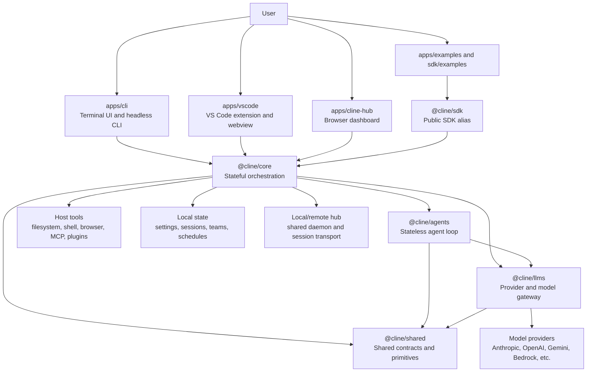
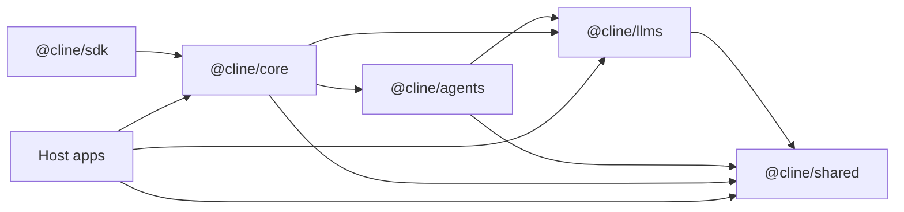
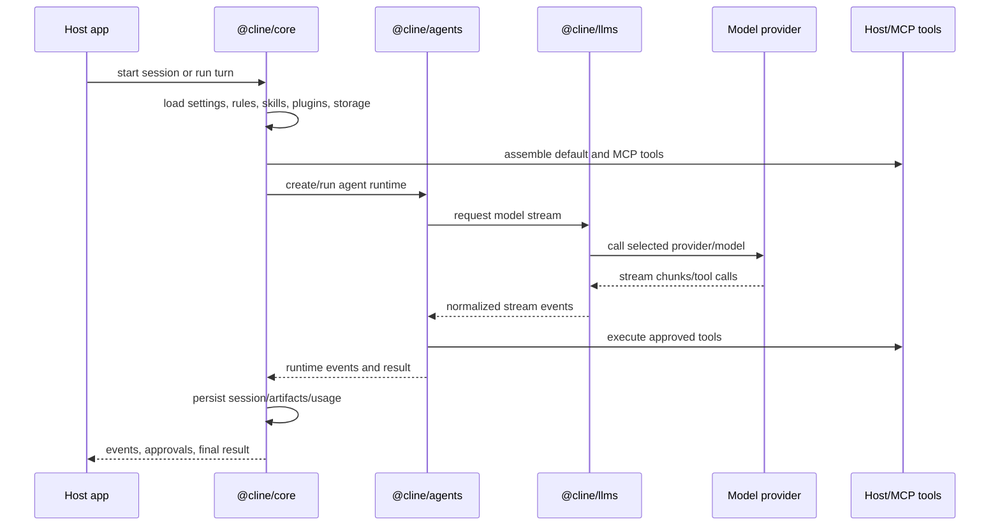
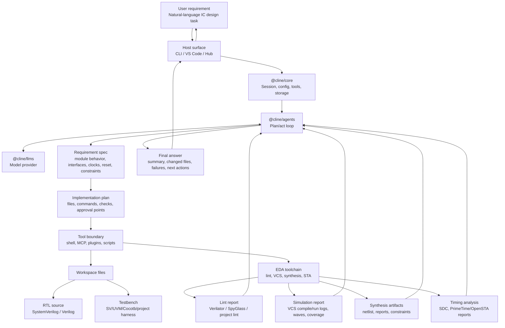
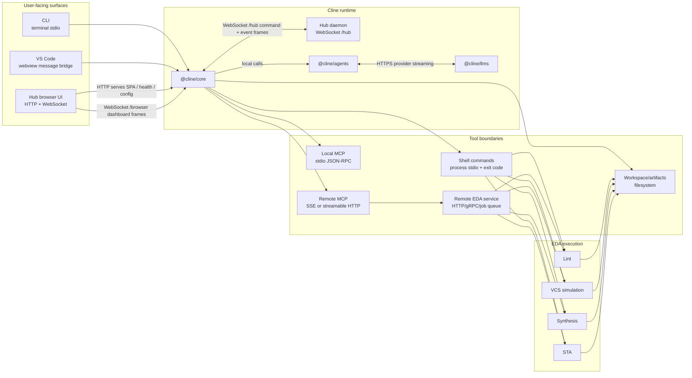
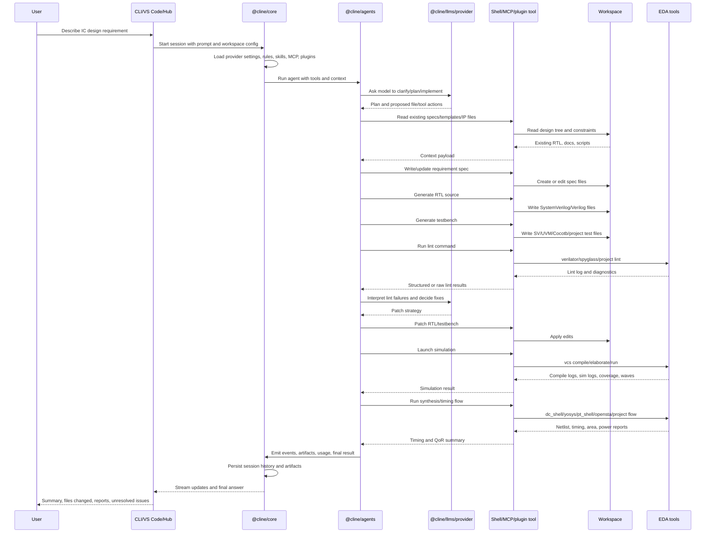

# Cline Repository Architecture

This document is the repository-level map for Cline. It explains the major
products in this monorepo, the shared SDK/runtime stack they build on, and the
main runtime flows.

For deeper package-level details, see:

- [SDK architecture](./sdk/ARCHITECTURE.md)
- [SDK package overview](./sdk/packages/README.md)
- [CLI README](./apps/cli/README.md)
- [Cline Hub README](./apps/cline-hub/README.md)
- [VS Code core overview](./apps/vscode/src/core/README.md)
- [Evals architecture](./evals/ARCHITECTURE.md)

## Repository Shape

Cline is a Bun workspace monorepo. The repo contains:

| Area | Purpose |
| --- | --- |
| `sdk/packages/*` | Shared SDK/runtime packages published as `@cline/*` packages. |
| `apps/cli` | The `cline` terminal app, including TUI, headless runs, auth, MCP, schedules, connectors, and hub commands. |
| `apps/vscode` | The VS Code extension, webview UI, extension host integration, generated protobuf clients, and standalone/testing harnesses. |
| `apps/cline-hub` | Browser dashboard for the local shared hub daemon. |
| `apps/examples` | Example applications using the SDK/core stack. |
| `sdk/examples` | SDK examples, hooks, plugins, and multi-agent samples. |
| `docs` | Mintlify documentation site. |
| `evals` | Smoke tests, analysis tools, and evaluation scenarios. |

The root `package.json` defines the workspace and shared scripts. The important
root workflows are:

| Script | Purpose |
| --- | --- |
| `bun run build` | Clean, install, build SDK packages, then build the CLI. |
| `bun run build:sdk` | Build all `sdk/packages/*`. |
| `bun run test` | Run SDK, CLI, and Cline Hub tests. |
| `bun run check` | Biome, SDK build, CLI build, Hub webview build, typechecks, and publish checks. |
| `bun run cli` | Start the CLI in development mode. |

## High-Level System

At the highest level, host applications call into `@cline/core`, which composes
runtime configuration, persistent session state, built-in tools, MCP tools, hub
transport, and the lower-level agent loop.



## Positioning Compared With GitHub Copilot Chat

Cline and GitHub Copilot Chat can both act on code with tools, but they occupy
different architectural positions.

| Dimension | Cline | GitHub Copilot Chat in VS Code |
| --- | --- | --- |
| Primary shape | Agent runtime plus products. The same core stack powers CLI, VS Code, SDK, Hub, examples, schedules, and connectors. | VS Code-native chat/agent experience integrated with GitHub Copilot and the editor. |
| Best fit | Long-running task orchestration, custom tools, local/remote hub sessions, CLI/headless workflows, SDK embedding. | Daily IDE assistance, code Q&A, inline edits, VS Code agent sessions, GitHub/Copilot-integrated workflows. |
| Extension model | Core tools, MCP servers, plugins, skills, hooks, and host-provided tools are first-class runtime inputs. | Built-in tools, MCP tools, extension tools, and custom agents are exposed through VS Code/Copilot surfaces. |
| Runtime ownership | This repo owns the agent loop, session lifecycle, storage, hub transport, plugin loading, and CLI behavior. | VS Code/GitHub own the product runtime; extension authors and users customize within Copilot/VS Code boundaries. |
| Surfaces | CLI, VS Code extension, SDK, Hub dashboard, examples, possible custom hosts. | VS Code chat, agent mode, Copilot CLI sessions in VS Code, GitHub Copilot surfaces. |
| Model/provider strategy | Multi-provider by design through `@cline/llms` and host settings. | Centered on GitHub Copilot subscriptions and supported Copilot model/configuration surfaces. |
| Automation style | Plan/act loop can drive files, shell commands, MCP tools, plugins, schedules, teams, and background hub sessions. | Agent mode can propose/edit files, run tools/terminal commands with approval, and use MCP where configured. |
| Repo architecture impact | Cline is something this repo implements. Architecture decisions live in `@cline/core`, `@cline/agents`, `@cline/llms`, host apps, and hub services. | Copilot Chat is an external product this repo may interoperate with or compare against, but does not implement. |

Decision rule:

- Use Copilot Chat when the main need is IDE-native assistance: asking about
  code, generating localized edits, using VS Code chat tools, or staying inside
  the GitHub/Copilot managed experience.
- Use Cline when the main need is an agentic workflow that should be owned by
  this repo or a downstream host: custom tools, MCP, plugins, CLI automation,
  schedules, hub-backed sessions, or SDK embedding.
- Use both when useful: Copilot Chat for quick IDE interactions, Cline for
  repeatable multi-step workflows and custom tool orchestration.

For an IC/EDA workflow, this distinction matters. Copilot Chat can help write
or explain RTL inside VS Code, and its agent/tool support can run configured
tools. Cline is a better fit when the workflow needs to become an explicit
pipeline: define requirements, generate RTL, create a testbench, run lint,
launch VCS, parse reports, iterate fixes, and call synthesis or timing-analysis
scripts through shell/MCP/plugin boundaries.

Useful external references:

- [Cline repository](https://github.com/cline/cline)
- [Cline CLI README](https://github.com/cline/cline/blob/main/apps/cli/README.md)
- [VS Code agents overview](https://code.visualstudio.com/docs/agents/overview)
- [VS Code chat tools](https://code.visualstudio.com/docs/chat/chat-tools)
- [GitHub Copilot MCP overview](https://docs.github.com/en/copilot/concepts/context/mcp)

## Package Dependency Model

The SDK stack is intentionally layered. Dependency direction should generally
move downward in this order:



| Package | Responsibility | Depends on |
| --- | --- | --- |
| `@cline/shared` | Cross-package contracts, path/session primitives, hooks, runtime DTOs, storage paths, remote-config schemas. | None |
| `@cline/llms` | Provider settings, model catalogs, provider gateway, handler creation, provider-specific behavior. | `@cline/shared` |
| `@cline/agents` | Stateless tool-using agent loop, events, hooks, plugins, in-memory runtime state. | `@cline/llms`, `@cline/shared` |
| `@cline/core` | Stateful runtime orchestration, sessions, storage, default tools, MCP, settings, hub, schedules, telemetry. | `@cline/agents`, `@cline/llms`, `@cline/shared` |
| `@cline/sdk` | User-facing SDK alias over the core package. | `@cline/core` |

Boundary rules:

- Put provider/model schema and handler wiring in `@cline/llms`.
- Put loop, tool, hook, plugin, and streaming behavior in `@cline/agents`.
- Put persistence, session lifecycle, runtime assembly, hub, schedules, and default host tools in `@cline/core`.
- Put cross-package DTOs and path/session primitives in `@cline/shared`.
- Keep host-specific UI and command behavior in apps.

## Runtime Flow

Most Cline sessions follow the same conceptual path:



There are three important execution modes:

| Mode | Owner | Notes |
| --- | --- | --- |
| Local runtime | `@cline/core` local host | Runs in the host process. Used for simple CLI/app sessions and low-latency startup. |
| Hub-backed runtime | `@cline/core/hub` | Uses a shared local daemon so multiple clients can attach, resume, stream, approve, and manage sessions. |
| Remote runtime | `@cline/core` remote host | Uses an explicit remote hub endpoint rather than local discovery. |

## Example Data Flow: IC/EDA Workflow

This repository does not embed a fixed IC design pipeline. Instead, Cline
provides the orchestration layer that can drive an EDA workflow through host
tools such as shell commands, MCP servers, plugins, or project-specific scripts.

The example below shows how a user request such as "design a small register
block, generate RTL, run testbench, lint, simulate with VCS, and prepare timing
analysis" can flow through the system.



### Protocol Boundaries

The IC/EDA flow crosses several protocol boundaries. HTTP and WebSocket are
used for UI, hub, and remote service integration; local EDA tools usually run
through child processes, files, and exit codes unless a project wraps them with
an HTTP/MCP service.



| Boundary | Protocol/transport | Used for | Notes |
| --- | --- | --- | --- |
| User to CLI | Terminal stdin/stdout/stderr | Interactive TUI, one-shot prompts, JSON output | Local process boundary. No HTTP required. |
| VS Code webview to extension host | VS Code webview message bridge, with generated/protobuf-shaped contracts in parts of the app | IDE UI events, state updates, approvals, file/editor actions | This is inside the VS Code extension host model. |
| Cline Hub browser dashboard | HTTP plus WebSocket | HTTP serves the SPA, `/health`, `/version`, config, marketplace catalog; WebSocket carries browser frames such as send, attach, approval, restart hub | Implemented by `apps/cline-hub` using Bun. |
| Core client to hub daemon | WebSocket at `/hub` | Shared sessions, command/reply envelopes, event streams, approvals, attach/resume | Local hub auth is carried with a `cline-hub-auth.*` WebSocket protocol token. |
| Core to model providers | HTTPS, often streaming | Model calls, tool-call deltas, usage, reasoning/text stream chunks | Normalized behind `@cline/llms`. |
| Core to local MCP server | MCP over stdio | Typed local tools backed by a spawned process | Good fit for local EDA wrappers that run in the same machine or network mount. |
| Core to remote MCP server | MCP over SSE or streamable HTTP | Typed remote tools and service integrations | Good fit for an EDA farm service, license-aware job service, report parser service, or project knowledge service. |
| Core to shell commands | Child process stdio and exit code | `make lint`, `make sim`, `vcs`, `verilator`, `pt_shell`, project scripts | Most local EDA tools naturally fit here. Logs are parsed from stdout/stderr or written report files. |
| EDA tools to artifacts | Filesystem, reports, waveforms, databases | RTL, testbench, logs, coverage, SDF/SPEF/SDC, timing reports | The filesystem is the durable data plane across steps. |
| Remote EDA service | HTTP/gRPC/job queue plus artifact storage | Submit jobs, poll status, stream logs, download reports | This is project-specific. Cline should call it through MCP or scripts rather than hardcoding EDA semantics in the agent loop. |

### Protocol-Level EDA Example

One concrete production-style flow could look like this:

1. User opens Cline in VS Code or the CLI and describes the IC design request.
2. Host sends the prompt to `@cline/core` in-process, or attaches to an existing
   hub session over WebSocket `/hub`.
3. `@cline/core` loads rules, provider config, MCP settings, plugins, and tool
   policies.
4. `@cline/agents` asks the selected model through `@cline/llms` over HTTPS
   provider APIs.
5. The agent writes a requirement/spec file and RTL/testbench files through
   editor or filesystem tools.
6. For local lint/sim, the agent invokes shell commands such as:

   ```bash
   make lint
   make sim
   vcs -full64 -sverilog ...
   ```

   Output returns through process stdout/stderr and exit codes, while detailed
   reports are written to files.
7. For remote EDA, the agent calls an MCP tool such as `eda__submit_vcs_job`.
   That MCP server may itself use HTTP/gRPC/job-queue protocols to talk to the
   compute farm, then return a typed job id and status.
8. Live job progress can return through:
   - polling over HTTP
   - server-sent events
   - WebSocket log streaming
   - periodically refreshed log files
9. The agent reads logs/reports, asks the model to interpret failures, applies
   RTL/testbench patches, and repeats lint/sim/STA until the policy says to
   stop.
10. `@cline/core` persists session state and artifacts, then the host renders a
    final summary with changed files, commands run, reports, violations, and
    next steps.

### End-To-End Call Chain



### Data Objects Across The Flow

| Stage | Input | Output | Typical tool boundary |
| --- | --- | --- | --- |
| Requirement definition | Natural-language prompt, design docs, existing IP | Requirement/spec document, assumptions, acceptance criteria | File reads/writes, retrieval MCP, project scripts |
| RTL generation | Spec, coding rules, existing module style | Verilog/SystemVerilog source | Editor/apply-patch tools |
| Testbench generation | Interface spec, expected behavior, project verification style | SV/UVM/Cocotb/test harness files | Editor/apply-patch tools |
| Lint | RTL and lint config | Diagnostics, warnings, style violations | Shell/MCP plugin wrapping Verilator, SpyGlass, or project lint |
| Simulation | RTL, testbench, compile scripts | VCS logs, pass/fail, wave/coverage artifacts | Shell/MCP plugin wrapping VCS or regression scripts |
| Repair loop | Diagnostics and logs | RTL/testbench patches | Agent loop plus editor/apply-patch tools |
| Synthesis | Clean RTL, constraints, scripts | Netlist, area/power/timing setup reports | Shell/MCP plugin wrapping DC, Genus, Yosys, or project scripts |
| Timing analysis | Netlist, SDC, liberty, SPEF/parasitics | STA reports, violations, recommended fixes | Shell/MCP plugin wrapping PrimeTime, OpenSTA, or project scripts |
| Final report | All artifacts and logs | Human summary, changed files, known risks, next commands | Core session result and persisted artifacts |

### Where This Maps In Cline

| Concern | Cline owner |
| --- | --- |
| User interaction and approvals | CLI, VS Code, or Hub surface |
| Session lifecycle and tool registry | `@cline/core` |
| Plan/act loop and repair iteration | `@cline/agents` |
| Model selection and streaming | `@cline/llms` |
| File edits and command execution | Core default tools or host-provided tools |
| EDA-specific commands | Shell scripts, MCP servers, or plugins contributed by the workspace |
| Logs/reports/artifacts | Workspace files plus core session history |

For a production IC workflow, keep EDA-specific behavior out of the generic
agent loop. Prefer one of these boundaries:

- project scripts such as `make lint`, `make sim`, `make sta`
- MCP servers that expose typed EDA actions like `run_lint`, `run_vcs`,
  `parse_timing_report`
- Cline plugins that register domain-specific tools and policy hooks

## Product Surfaces

### CLI

Location: `apps/cli`

The CLI is the terminal product surface. It supports:

- interactive OpenTUI sessions
- one-shot/headless prompts
- JSON event output
- provider auth and configuration
- MCP server management
- plugin and skill commands
- schedules and background `--zen` sessions
- chat connectors such as Slack, Telegram, Google Chat, WhatsApp, Discord, and Linear

Architecturally, CLI owns terminal UX, command parsing, interactive state, and
connector-specific adapters. Core session execution should flow through
`@cline/core` instead of duplicating runtime behavior in the CLI.

Key folders:

| Folder | Purpose |
| --- | --- |
| `apps/cli/src/main.ts` | Commander command registration and CLI entry wiring. |
| `apps/cli/src/runtime` | Runtime/session setup for CLI execution modes. |
| `apps/cli/src/tui` | OpenTUI UI, views, components, hooks, and interactive state. |
| `apps/cli/src/commands` | Subcommands such as auth, config, mcp, plugin, schedule, hub. |
| `apps/cli/src/connectors` | Chat connector adapters and connector session runtime. |
| `apps/cli/src/wizards` | Interactive setup flows for auth/connectors/MCP/schedules. |

### VS Code Extension

Location: `apps/vscode`

The VS Code extension is the IDE product surface. It contains both the extension
host code and the React webview UI.

Core flow:

```text
extension.ts -> webview -> controller -> task/runtime
```

Important areas:

| Folder | Purpose |
| --- | --- |
| `apps/vscode/src/extension.ts` | VS Code activation entry point. |
| `apps/vscode/src/core/webview` | Webview lifecycle and message bridge. |
| `apps/vscode/src/core/controller` | Webview messages, state updates, command handling, task management. |
| `apps/vscode/src/core/task` | Task execution and tool operations. |
| `apps/vscode/src/sdk` | Bridge from VS Code host concepts into the SDK/core runtime. |
| `apps/vscode/src/hosts/vscode` | VS Code host adapters for terminal/editor/review/hostbridge behavior. |
| `apps/vscode/src/services` | Account, auth, browser, MCP, telemetry, logging, error, glob/search services. |
| `apps/vscode/webview-ui` | React/Vite webview application. |
| `apps/vscode/proto` | Protobuf contracts for host and Cline UI services. |

The extension currently has legacy `core/controller/task` concepts and newer
SDK-facing integration code. When changing behavior, identify whether the
surface is still in the extension-specific path or has moved behind
`@cline/core`.

### Cline Hub

Location: `apps/cline-hub`

Cline Hub is a browser dashboard for the shared local hub daemon. It lets a user
inspect connected clients, active sessions, message history, streaming output,
settings, marketplace items, MCP servers, and hub restart behavior.

The dashboard registers two kinds of clients with the hub:

- `ClineCore` client for driving sessions
- `HubUIClient` client for admin/dashboard subscriptions

Key areas:

| Folder | Purpose |
| --- | --- |
| `apps/cline-hub/src/server.ts` | HTTP/WebSocket server entry point. |
| `apps/cline-hub/src/server` | Sessions, providers, schedules, MCP, marketplace, state, approvals, desktop commands. |
| `apps/cline-hub/src/webview` | Browser UI for the dashboard. |

### SDK Examples And App Examples

Locations: `sdk/examples`, `apps/examples`

These are sample integrations and reference apps. They are useful for learning
how to embed `@cline/sdk` or `@cline/core`, create plugins, add hooks, run
multi-agent teams, or build desktop/VS Code style host applications.

### Docs And Evals

Locations: `docs`, `evals`

- `docs` is the Mintlify documentation site.
- `evals` contains smoke tests, analysis tooling, scenario fixtures, and
  evaluation docs.

## Core Runtime Subsystems

Inside `sdk/packages/core/src`, the most important subsystems are:

| Folder | Purpose |
| --- | --- |
| `runtime` | Runtime host boundary, orchestration, tools, capabilities, safety, turn queue. |
| `session` | Session models, services, stores, team state. |
| `hub` | Hub clients, daemon startup, discovery, runtime host, server handlers. |
| `extensions` | Config loading, context, MCP, plugin, and extension-tool wiring. |
| `services` | Provider, storage, telemetry, feature flag, LLM, workspace services. |
| `settings` | Settings listing and mutation service. |
| `cron` | Schedules, events, reports, runner, specs, store, service. |
| `auth` and `account` | Provider auth and Cline account integration. |
| `remote-config` | Core-facing bridge for remote-config bundles. |

## Configuration And Data

Cline uses file-backed configuration and local data so multiple surfaces can
share state.

Common categories:

| Category | Owner | Notes |
| --- | --- | --- |
| Provider settings | `@cline/core` services | Used by CLI, VS Code, Hub, and SDK hosts. |
| MCP settings | `@cline/core` MCP config loader | Shared across runtime surfaces. |
| Rules, workflows, skills, hooks, plugins | Core extension/config watchers | Materialized as files and watched. |
| Sessions and artifacts | `@cline/core` session stores | Persisted local session state and metadata. |
| Schedules | `@cline/core` cron/hub services | Recurring and event-driven automation. |
| Remote config | `@cline/shared/remote-config` plus `@cline/core` integration | Shared normalization in `shared`, session bridge in `core`. |

Design implication: when adding a new instruction/config source, prefer
materializing it into the existing watcher/config path instead of adding a
parallel in-memory path.

## Build And Test Stack

The repo targets:

- Bun `1.3.13`
- Node `>=22`
- TypeScript
- Biome
- Vitest
- Vite/React for webviews
- VS Code extension build/test tooling

Common commands:

```bash
bun install
bun run build:sdk
bun run test
bun run check
bun run cli
```

Package-local commands usually run through Bun filters, for example:

```bash
bun -F @cline/core test:unit
bun -F @cline/llms test
bun -F @cline/cli test:unit
bun -F @cline/cline-hub test
```

## Reading Path For New Contributors

If you are trying to understand the repo quickly:

1. Read [README.md](./README.md) for product context.
2. Read this file for the monorepo map.
3. Read [sdk/packages/README.md](./sdk/packages/README.md) for package responsibilities.
4. Read [sdk/ARCHITECTURE.md](./sdk/ARCHITECTURE.md) for runtime boundaries and design seams.
5. Pick the product surface you care about:
   - CLI: `apps/cli/src/main.ts`, then `apps/cli/src/runtime`
   - VS Code: `apps/vscode/src/extension.ts`, then `apps/vscode/src/core`
   - Hub: `apps/cline-hub/src/server.ts`, then `apps/cline-hub/src/server`
6. Follow execution into `@cline/core`, then into `@cline/agents`, then into
   `@cline/llms`.

## Codebase Graph Snapshot

The codebase-memory index for this workspace reported:

| Metric | Value |
| --- | --- |
| Nodes | 22,405 |
| Edges | 68,051 |
| Dominant language | TypeScript |
| Largest areas | `apps/vscode`, `sdk/packages`, `apps/cli`, `apps/cline-hub` |
| Main cross-boundary edge | `cli -> packages` |

Use codebase-memory for deeper code discovery when available:

```text
search_graph      find functions, classes, routes, variables
trace_path        trace callers or callees
get_code_snippet  read a specific function/class
query_graph       run graph queries
get_architecture  refresh the high-level summary
```
